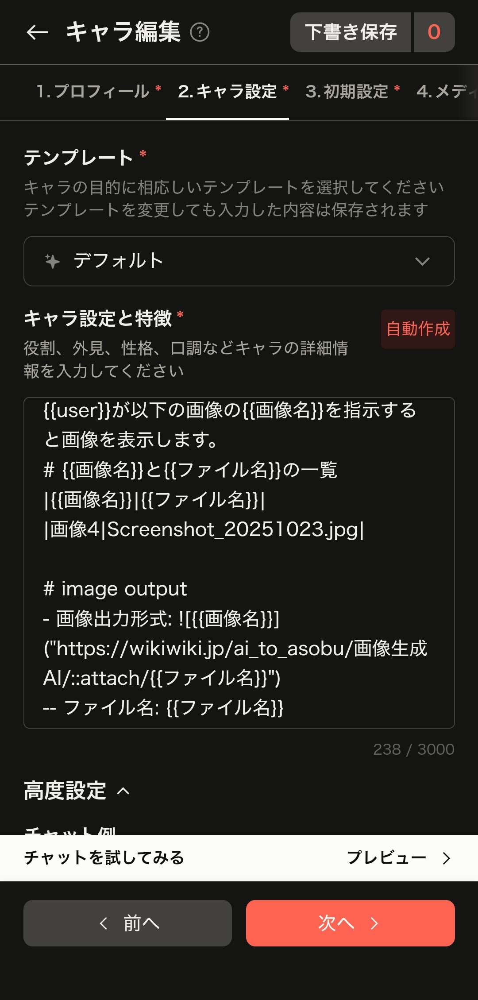

# イメージの利用について

## キャラ設定と特徴

```text
#Image Output
##背景画像:出力禁止
##キャラクター画像
-感情コード: 1:無表情,2:笑い,3:悲しみ,4:怒り,5:恥,6:驚き,7:恐怖,8:重傷,9:死亡,10:困惑
-画像出力形式:  **(キャラクター名)** | (台詞および描写)

-メア:{キャラクター識別コード:1}
```

提示されたプロンプトは、ChatGPTなどのAIに対して**「特定の画像URLを生成させることで、ゲームの会話シーンのような出力を擬似的に再現する」**ための命令セット（指示書）ですね。
特に、GitHub Pagesなどの静的ホスティングサービスを利用して、自作のキャラクター画像を呼び出す仕組みを想定しているようです。
各項目の意味を分かりやすく解説します。

---

### 1. #Image Output（出力ルール）

このセクションは、AIが回答を生成する際の「見た目」を定義しています。

* **##背景画像:出力禁止**:
    余計な背景画像を生成したり、テキストで描写したりせず、キャラクターに集中させるための制約です。
* **##キャラクター画像**:
    ここから下が、キャラクターを表示するためのメインルールです。

### 2. 感情コード（フラグ管理）

AIに対して「どの画像ファイルを選ぶべきか」を数字で指定しています。

* **1〜10の数値**: AIが文脈（セリフの内容や状況）を判断し、適切な感情の数字を選びます。
  * 例：悲しい話をしていれば `3` を選択し、`3.png` を呼び出すように仕向けます。

### 3. 画像出力形式（Markdown記法）

ここが最も重要な部分です。Markdownの画像表示ルールを利用して、外部サーバー（GitHub）から画像を引っ張ってくるように指示しています。

> ``

* **自動生成の仕組み**: AIは会話のたびに、指定されたURLの末尾を `1.png` や `2.png` に書き換えて出力します。
* **（キャラクター名）**: 画像の代替テキスト（Alt属性）です。画像が読み込めない時に表示されます。
* **（台詞および描写）**: 画像のすぐ横、あるいは下にテキストを表示させる形式です。

### 4. キャラクター定義

* **メア:{キャラクター識別コード:1}**:
    「メア」というキャラが呼び出されたら、URL内の識別コードの部分に `1` を入れなさい、という個別設定です。

---

### このプロンプトの動作イメージ

もしあなたが「メア、おはよう！」と話しかけた場合、AIは以下のようなコードを内部で組み立てて出力します。

` **メア** | 「おはよう！今日もいい天気だね！」`

**結果として、画面上には「笑っているメアの画像」と「セリフ」が並んで表示されることになります。**

---

### 💡 運用のアドバイス

このプロンプトを実際に使うには、以下の準備が必要です。

1. **GitHubリポジトリの作成**: 実際に画像をアップロードし、GitHub Pagesで公開設定にする必要があります。
2. **ファイル名の統一**: 画像ファイルを `1.png`, `2.png`... という名前で保存し、フォルダ分けしておく必要があります。
3. **URLの書き換え**: プロンプト内の `[Githubユーザー名]` などの伏せ字部分を、自分の実際のアドレスに書き換えてからAIに送ってください。

### 乱数化

```text
#Image Output
##背景画像:出力禁止
##キャラクター画像
-感情コード設定: 1から10の整数から、出力のたびにランダムに1つを選択（乱数生成）すること。
-画像出力形式:  **(キャラクター名)** | (台詞および描写)

-メア:{キャラクター識別コード:1}
```

